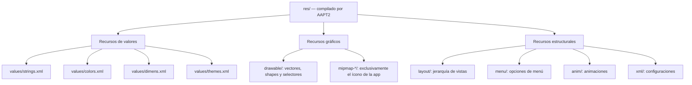
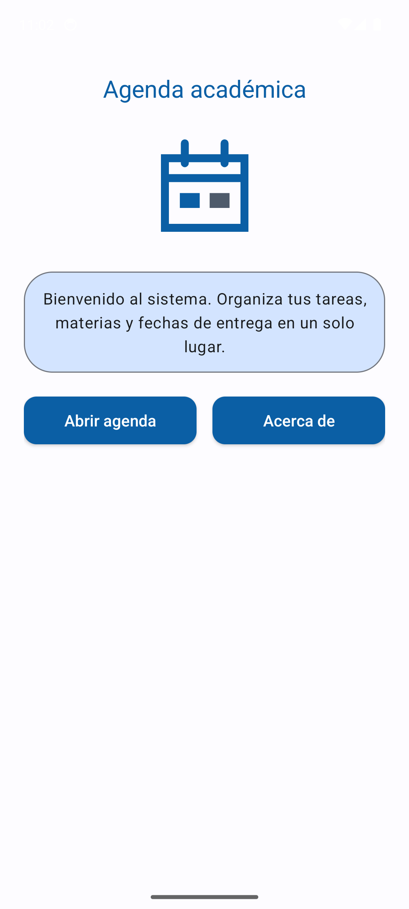
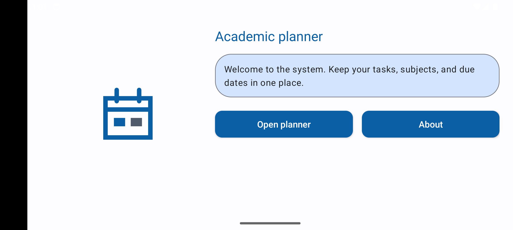
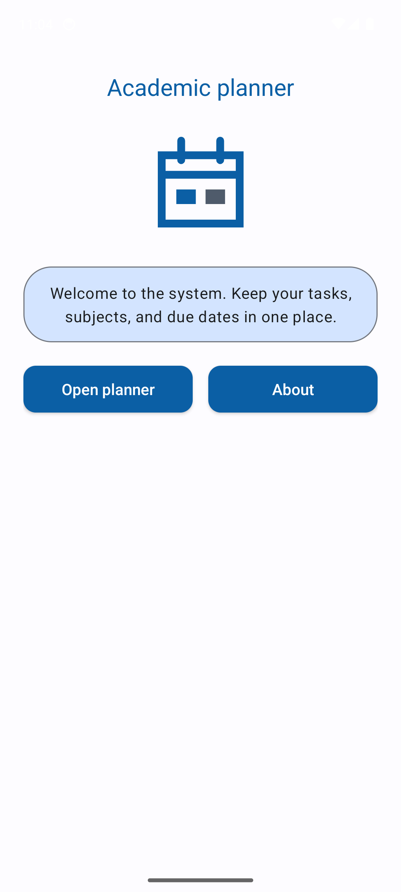
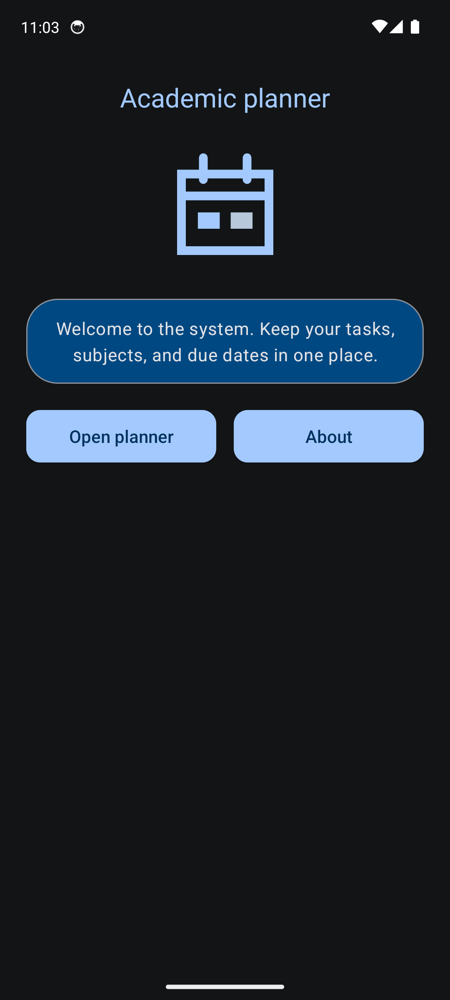
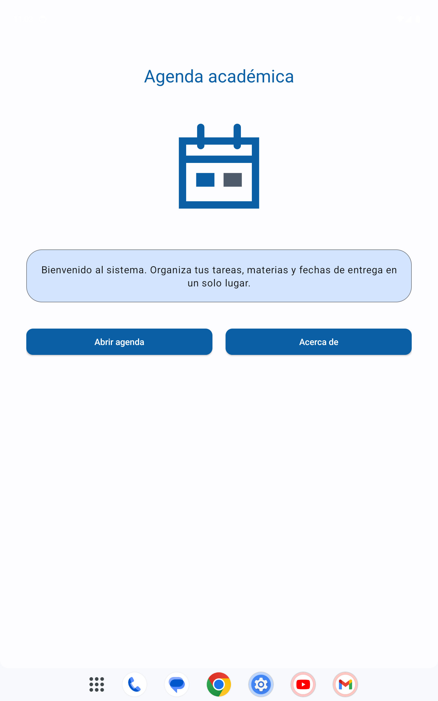

# Informe — Punto 3.7: Recursos de interfaz de usuario

## Carátula

- Asignatura: Programación de Dispositivos Móviles
- Proyecto: MiAgenda INTJEM
- Integrante 1: **Brita Varinia Perez Villegas**
- Integrante 2: **Carlos Andres Flores Carpio**
- Fecha de entrega: **21 de septiembre de 2026**

## Roles

| Actividad | Conductor | Navegante |
|---|---|---|
| AP-3.7.1 | Carlos Andres Flores Carpio | Brita Varinia Perez Villegas |
| AP-3.7.2 | Carlos Andres Flores Carpio | Brita Varinia Perez Villegas |
| AC-3.7.3 | Brita Varinia Perez Villegas | Carlos Andres Flores Carpio |

## AT-3.7.1 — Mapa de recursos



| Recurso | Carpeta | Acceso desde XML | Acceso desde Java |
|---|---|---|---|
| Nombre de la app | `values/strings.xml` | `@string/app_name` | `getString(R.string.app_name)` |
| Color primario | `values/colors.xml` | `@color/md_primary` | `ContextCompat.getColor(this, R.color.md_primary)` |
| Margen de pantalla | `values/dimens.xml` | `@dimen/screen_margin` | `getResources().getDimensionPixelSize(R.dimen.screen_margin)` |
| Tema principal | `values/themes.xml` | `@style/Theme.MiAgendaINTJEM` | `setTheme(R.style.Theme_MiAgendaINTJEM)` |
| Pantalla principal | `layout/activity_main.xml` | `@layout/activity_main` | `setContentView(R.layout.activity_main)` |
| Ícono de agenda | `drawable/ic_agenda.xml` | `@drawable/ic_agenda` | `ContextCompat.getDrawable(this, R.drawable.ic_agenda)` |
| Ícono de la app | `mipmap-anydpi/ic_launcher.xml` | `@mipmap/ic_launcher` | `R.mipmap.ic_launcher` |
| Menú | `menu/` | `@menu/menu_main` | `getMenuInflater().inflate(R.menu.menu_main, menu)` |
| Animación | `anim/` | `@anim/fade_in` | `AnimationUtils.loadAnimation(this, R.anim.fade_in)` |
| Archivo crudo | `raw/` | `@raw/example` | `getResources().openRawResource(R.raw.example)` |

`mipmap` se reserva para el ícono de lanzamiento porque el launcher puede solicitar una densidad distinta de la densidad física de la pantalla. Mantener sus variantes permite que el sistema escoja una imagen nítida. Los demás gráficos pertenecen en `drawable`.

## AT-3.7.2 — Auditoría de malas prácticas

| Línea observada | Tipo de falla | Consecuencia | Corrección |
|---|---|---|---|
| `layout_width="320px"` | Unidad incorrecta y ancho fijo | El tamaño físico cambia con la densidad y no se adapta al espacio disponible. | Usar `0dp` con restricciones o `wrap_content`. |
| `text="Bienvenido al sistema"` | Cadena literal | Impide seleccionar otra traducción y genera `HardcodedText`. | `text="@string/welcome_message"` |
| `textSize="18px"` | Unidad incorrecta para texto | Ignora `fontScale`; perjudica a usuarios con baja visión. | `textSize="@dimen/text_body"`, definido en `sp`. |
| `textColor="#FF5722"` | Color literal | No admite variante nocturna y su contraste sobre blanco es insuficiente para texto normal. | `textColor="@color/md_on_surface"` o `?attr/colorOnSurface`. |
| `padding="16px"` | Unidad y dimensión no parametrizadas | El espaciado se reduce en pantallas densas y se repite una decisión visual. | `padding="@dimen/spacing_medium"` |
| Sin `android:id` | Falta estructural | La vista no puede enlazarse desde Java ni actuar como ancla. | `android:id="@+id/welcomeText"` |

### Preguntas de discusión

1. Si se usa `px`, el texto no responde al tamaño de fuente configurado por el usuario. `sp` incorpora tanto la densidad como `fontScale`; `px` fija directamente el resultado físico. Además de verse distinto entre densidades, el texto en `px` rompe una adaptación de accesibilidad esencial.

2. Android internacionaliza seleccionando variantes de un recurso con el mismo identificador. Una cadena literal no tiene una entrada intercambiable en `resources.arsc`; por eso debe externalizarse antes de poder crear `values-en`, plurales o traducciones profesionales.

3. Una paleta centralizada ofrece un punto único de cambio, habilita `values-night`, permite auditar contraste y da al equipo un vocabulario semántico. El costo de cambiar una decisión de color deja de crecer con la cantidad de pantallas.

## AP-3.7.1 — Proyecto base

La pantalla principal se construyó con `ConstraintLayout` y contiene encabezado, vector de agenda, mensaje de bienvenida y dos botones. Los layouts solo referencian recursos para textos, colores, dimensiones y gráficos. Java enlaza vistas, responde a pulsaciones y, en `applyResources`, resuelve por identificador los mismos recursos que el layout ya declara, a modo de demostración del acceso desde código.

Archivos principales:

- `app/src/main/res/values/colors.xml`
- `app/src/main/res/values/dimens.xml`
- `app/src/main/res/values/strings.xml`
- `app/src/main/res/values/themes.xml`
- `app/src/main/res/layout/activity_main.xml`
- `app/src/main/java/com/example/miagendaintjem/MainActivity.java`

### Fragmentos de código relevantes

Estilo propio `EstiloBotonPrincipal`, exigido por el requerimiento 5, definido en `values/themes.xml`:

```xml
<style name="EstiloBotonPrincipal" parent="Widget.AppCompat.Button">
    <item name="android:background">@drawable/fondo_boton_redondeado</item>
    <item name="backgroundTint">@null</item>
    <item name="android:textColor">@color/md_on_primary</item>
    <item name="android:textSize">@dimen/text_label</item>
    <item name="android:minHeight">@dimen/button_height</item>
    <item name="android:textAllCaps">false</item>
    <item name="android:elevation">@dimen/button_elevation</item>
</style>
```

`backgroundTint` se anula porque, de lo contrario, el tinte del tema pintaría encima del
drawable y las esquinas redondeadas dejarían de verse.

Drawable `shape` con esquinas redondeadas, exigido por el requerimiento 6
(`drawable/fondo_boton_redondeado.xml`):

```xml
<shape xmlns:android="http://schemas.android.com/apk/res/android"
    android:shape="rectangle">
    <solid android:color="@color/md_primary" />
    <corners android:radius="@dimen/corner_medium" />
    <stroke
        android:width="@dimen/button_border_width"
        android:color="@color/md_primary" />
</shape>
```

Botón dentro del `ConstraintLayout`: ningún atributo lleva un valor literal, y el estilo
se aplica con `style` en lugar de repetir las propiedades en cada vista.

```xml
<androidx.appcompat.widget.AppCompatButton
    android:id="@+id/openAgendaButton"
    style="@style/EstiloBotonPrincipal"
    android:layout_width="0dp"
    android:layout_height="@dimen/button_height"
    android:layout_marginTop="@dimen/spacing_large"
    android:text="@string/open_agenda_button"
    app:layout_constraintEnd_toStartOf="@id/aboutButton"
    app:layout_constraintStart_toStartOf="parent"
    app:layout_constraintTop_toBottomOf="@id/welcomeText" />
```

Acceso a los mismos recursos desde Java, que es la columna derecha de la tabla de
AT-3.7.1 llevada a código real (`MainActivity.java`):

```java
private void applyResources() {
    String welcomeMessage = getString(R.string.welcome_message);
    int textColor = ContextCompat.getColor(this, R.color.md_on_primary_container);
    int padding = getResources().getDimensionPixelSize(R.dimen.spacing_medium);

    welcomeText.setText(welcomeMessage);
    welcomeText.setTextColor(textColor);
    welcomeText.setPadding(padding, padding, padding, padding);
}
```

El método reaplica exactamente los mismos recursos que ya declara el layout. Existe como
demostración del acceso desde Java, no como una segunda fuente de decisiones visuales.

**Captura vertical en español (Android 14, API 34):**



## AP-3.7.2 — Adaptabilidad

La aplicación delega toda adaptación al sistema de recursos:

- `layout-land/activity_main.xml` reorganiza el contenido y conserva los mismos IDs usados por Java.
- `values-en/strings.xml` contiene la traducción inglesa.
- `values-night/colors.xml` redefine los mismos roles semánticos para modo oscuro.
- `values-sw600dp/dimens.xml` amplía márgenes, espaciado, imagen y tipografía en tablet.
- `drawable/ic_agenda.xml` conserva nitidez porque se rasteriza de nuevo para cada densidad.

### Fragmentos de código relevantes

Mismos identificadores en ambas orientaciones. El error que la guía anticipa —cambiar los
`android:id` al duplicar el layout— se evita porque Java solo conoce `welcomeText`,
`openAgendaButton` y `aboutButton`, y los dos archivos los conservan:

```xml
<!-- layout/activity_main.xml y layout-land/activity_main.xml -->
<TextView android:id="@+id/welcomeText" ... />
<androidx.appcompat.widget.AppCompatButton android:id="@+id/openAgendaButton" ... />
<androidx.appcompat.widget.AppCompatButton android:id="@+id/aboutButton" ... />
```

La variante horizontal añade además una `Guideline` (`@+id/contentGuideline`) que reparte
el ancho en dos columnas. No se referencia desde Java, por lo que no rompe el enlace de
vistas.

Modo oscuro: `values-night/colors.xml` redefine los mismos nombres, nunca nombres nuevos.

```xml
<!-- values/colors.xml -->        <!-- values-night/colors.xml -->
<color name="md_surface">#FDFCFF</color>    <color name="md_surface">#121416</color>
<color name="md_on_surface">#1A1C1E</color> <color name="md_on_surface">#E2E2E6</color>
```

Tablet: `values-sw600dp/dimens.xml` sobrescribe solo las dimensiones que cambian.

```xml
<dimen name="screen_margin">48dp</dimen>
<dimen name="agenda_image_size">200dp</dimen>
<dimen name="text_title">32sp</dimen>
```

### Evidencia de adaptabilidad

Las imágenes siguientes se capturaron desde el mismo APK, sin cambiar código Java entre pruebas. Android seleccionó los recursos según idioma, orientación, modo nocturno y ancho mínimo disponible.

| Variante | Recurso alternativo comprobado | Evidencia |
|---|---|---|
| Horizontal | `layout-land/activity_main.xml` |  |
| Inglés | `values-en/strings.xml` |  |
| Modo oscuro | `values-night/colors.xml` |  |
| Tablet | `values-sw600dp/dimens.xml` |  |

La prueba tablet usó temporalmente `1600 × 2560 px` a `320 dpi`. Android informó `sw800dp`, por lo que la selección de `values-sw600dp` quedó verificada. Al finalizar se restauró el Pixel 6 a su tamaño físico de `1080 × 2400 px` y `420 dpi`.

## AC-3.7.3 — Sistema de diseño Material 3

El tema hereda de `Theme.Material3.DayNight.NoActionBar`. La paleta define roles primarios, secundarios, de superficie y de error con sus pares `on*`. También se declararon tres escalas de forma y cinco apariencias tipográficas para que los componentes de 3.8 hereden decisiones coherentes.

### Lámina del sistema de diseño

**Paleta por rol semántico**

| Rol | Claro | Oscuro | Uso |
|---|---|---|---|
| `md_primary` / `md_on_primary` | `#0B5FA5` / `#FFFFFF` | `#A3C9FF` / `#00315D` | Acción principal y su texto. |
| `md_primary_container` / `md_on_primary_container` | `#D3E4FF` / `#001C38` | `#004881` / `#D3E4FF` | Panel de bienvenida. |
| `md_secondary` / `md_on_secondary` | `#4F5B6B` / `#FFFFFF` | `#B7C8DA` / `#21323F` | Acentos de apoyo. |
| `md_surface` / `md_on_surface` | `#FDFCFF` / `#1A1C1E` | `#121416` / `#E2E2E6` | Fondo de pantalla y texto base. |
| `md_surface_variant` / `md_on_surface_variant` | `#DFE2EB` / `#43474E` | `#43474E` / `#C3C7CF` | Texto secundario. |
| `md_outline` | `#73777F` | `#8D9199` | Bordes y separadores. |
| `md_error` / `md_on_error` | `#BA1A1A` / `#FFFFFF` | `#FFB4AB` / `#690005` | Estados de error. |

**Escala tipográfica** (`values/dimens.xml`, siempre en `sp`)

| Estilo | Rol Material 3 | Tamaño | Tablet (`sw600dp`) |
|---|---|---|---|
| `TextAppearance.MiAgenda.Display` | `displayLarge` | `36sp` | `36sp` |
| `TextAppearance.MiAgenda.Headline` | `headlineMedium` | `28sp` | `28sp` |
| `TextAppearance.MiAgenda.Title` | `titleLarge` | `24sp` | `32sp` |
| `TextAppearance.MiAgenda.Body` | `bodyLarge` | `16sp` | `18sp` |
| `TextAppearance.MiAgenda.Label` | `labelLarge` | `16sp` | `16sp` |

**Formas**

| Estilo | `cornerSize` | Aplicado a |
|---|---|---|
| `ShapeAppearance.MiAgenda.Small` | `@dimen/corner_small` = `8dp` | Componentes pequeños. |
| `ShapeAppearance.MiAgenda.Medium` | `@dimen/corner_medium` = `12dp` | Botones y tarjetas de 3.8. |
| `ShapeAppearance.MiAgenda.Large` | `@dimen/corner_large` = `28dp` | Panel de bienvenida. |

### Derivación de los tonos

Material Theme Builder parte de un color de marca —aquí el azul institucional `#0B5FA5`—
y lo convierte al espacio HCT, que separa matiz, croma y tono. Conservando el matiz y el
croma, genera una rampa de trece tonos fijos (0, 10, 20, 30, 40, 50, 60, 70, 80, 90, 95,
99, 100) donde el número es la luminosidad percibida. Cada rol toma un tono de esa rampa
en lugar de un valor elegido a mano:

| Rol | Tono en claro | Tono en oscuro |
|---|---|---|
| `primary` | 40 | 80 |
| `onPrimary` | 100 | 20 |
| `primaryContainer` | 90 | 30 |
| `onPrimaryContainer` | 10 | 90 |

Como la distancia entre tonos está fijada por la rampa, el contraste de cada par queda
garantizado por construcción y no depende del color de marca elegido: el modo oscuro
simplemente intercambia los extremos. Los roles neutros (`surface`, `onSurface`,
`outline`) se derivan de la misma familia con el croma reducido, lo que evita que el
fondo compita visualmente con la acción principal.

| Par | Claro | Oscuro | Mínimo para texto normal |
|---|---:|---:|---:|
| `primary` / `onPrimary` | 6.57:1 | 7.74:1 | 4.5:1 |
| `primaryContainer` / `onPrimaryContainer` | 13.33:1 | 7.27:1 | 4.5:1 |
| `surface` / `onSurface` | 16.72:1 | 14.29:1 | 4.5:1 |
| `error` / `onError` | 6.46:1 | 7.72:1 | 4.5:1 |

Nombrar por rol conserva el significado cuando cambia el valor. `md_surface` sigue representando una superficie tanto si vale casi blanco como si vale gris oscuro; un nombre como `blanco` dejaría de ser cierto en modo nocturno.

## Dificultades y resolución

- Al comienzo resultó difícil distinguir qué adaptaciones debían programarse en Java y cuáles correspondían al sistema de recursos. La pareja organizó los requisitos por calificadores; Brita revisó la correspondencia entre la guía y las carpetas alternativas, mientras Carlos implementó y ejecutó cada variante. Las pruebas con el mismo APK permitieron comprobar que Android seleccionaba automáticamente el idioma, la orientación, los colores nocturnos y las dimensiones para tablet.
- La discrepancia de nombre entre las guías 3.7 y 3.8 se resolvió usando `MiAgendaINTJEM`, que es el nombre exigido por la actividad donde se crea el proyecto. El nombre visible permanece externalizado para poder corregirlo sin tocar layouts ni Java.
- Una revisión final comparando XML y Java detectó que `applyResources` fijaba
  `md_on_surface` sobre el panel de bienvenida, mientras el layout declaraba
  `md_on_primary_container` para esa misma vista. Al ejecutarse después del inflado, Java
  ganaba silenciosamente. El contraste medido seguía siendo aceptable (13,27:1 frente a
  13,33:1 en claro), de modo que el fallo no era visible, pero duplicaba una decisión de
  color y contradecía el rol semántico del contenedor. Se igualó el recurso aplicado desde
  Java al que declara el layout: la demostración de acceso por código se conserva y deja de
  existir una segunda fuente de verdad.
- El SDK no tenía una imagen virtual instalada. Se añadieron las herramientas oficiales de línea de comandos y la imagen Google APIs de Android 14 para `arm64-v8a`; así se pudo validar el APK de forma nativa en Apple Silicon.

## Conclusiones individuales

- **Brita Varinia Perez Villegas:** En esta práctica comprendí cómo el sistema de recursos permite adaptar una aplicación sin duplicar lógica en Java. Mi trabajo se concentró principalmente en revisar la consigna, relacionar cada requisito con su carpeta correspondiente y verificar las variantes de idioma, orientación, modo oscuro y tablet. También aprendí la importancia de nombrar colores por su función dentro del diseño y de comprobar el contraste entre texto y fondo. Esta organización facilitará que las siguientes pantallas de la agenda mantengan una apariencia coherente y sean más sencillas de modificar.
- **Carlos Andres Flores Carpio:** En esta práctica reforcé el uso de `ConstraintLayout` y la creación de recursos reutilizables para textos, dimensiones, colores, estilos y gráficos vectoriales. Me encargué principalmente de implementar la estructura del proyecto, enlazar los componentes desde Java y ejecutar las pruebas en el emulador. Comprobé que centralizar las decisiones visuales reduce valores repetidos y permite que Android seleccione automáticamente la variante apropiada. Aplicaré este enfoque en las siguientes funcionalidades para mantener el código más claro y facilitar su mantenimiento.

## Anexo

El entregable de AP-3.7.1 exige anexar `colors.xml`, `dimens.xml` y `strings.xml`. Se
transcriben aquí en su totalidad; los originales están en `app/src/main/res/values/`.

### `values/colors.xml`

```xml
<?xml version="1.0" encoding="utf-8"?>
<resources>
    <color name="md_primary">#0B5FA5</color>
    <color name="md_on_primary">#FFFFFF</color>
    <color name="md_primary_container">#D3E4FF</color>
    <color name="md_on_primary_container">#001C38</color>

    <color name="md_secondary">#4F5B6B</color>
    <color name="md_on_secondary">#FFFFFF</color>
    <color name="md_secondary_container">#D3E4F5</color>
    <color name="md_on_secondary_container">#0B1926</color>

    <color name="md_surface">#FDFCFF</color>
    <color name="md_on_surface">#1A1C1E</color>
    <color name="md_surface_variant">#DFE2EB</color>
    <color name="md_on_surface_variant">#43474E</color>
    <color name="md_outline">#73777F</color>

    <color name="md_error">#BA1A1A</color>
    <color name="md_on_error">#FFFFFF</color>
    <color name="md_error_container">#FFDAD6</color>
    <color name="md_on_error_container">#410002</color>

    <color name="launcher_background">#0B5FA5</color>
</resources>
```

Dieciocho colores, todos con nombre de rol y no de valor. `values-night/colors.xml`
redefine los mismos identificadores, por lo que el modo oscuro no requiere una sola línea
de Java.

### `values/dimens.xml`

```xml
<?xml version="1.0" encoding="utf-8"?>
<resources>
    <dimen name="spacing_small">8dp</dimen>
    <dimen name="spacing_medium">16dp</dimen>
    <dimen name="spacing_large">24dp</dimen>
    <dimen name="screen_margin">24dp</dimen>

    <dimen name="corner_small">8dp</dimen>
    <dimen name="corner_medium">12dp</dimen>
    <dimen name="corner_large">28dp</dimen>
    <dimen name="button_border_width">1dp</dimen>
    <dimen name="button_elevation">2dp</dimen>

    <dimen name="button_height">48dp</dimen>
    <dimen name="agenda_image_size">120dp</dimen>
    <dimen name="vector_intrinsic_size">24dp</dimen>

    <dimen name="text_display">36sp</dimen>
    <dimen name="text_headline">28sp</dimen>
    <dimen name="text_title">24sp</dimen>
    <dimen name="text_body">16sp</dimen>
    <dimen name="text_label">16sp</dimen>
</resources>
```

Diecisiete dimensiones. Las de texto van en `sp` para respetar el tamaño de fuente del
sistema; el resto en `dp`. `values-sw600dp/dimens.xml` sobrescribe márgenes, espaciados,
tamaño de imagen y dos escalas tipográficas para tablet.

### `values/strings.xml`

```xml
<?xml version="1.0" encoding="utf-8"?>
<resources>
    <string name="app_name" translatable="false">MiAgenda INTJEM</string>

    <string name="header_title">Agenda académica</string>
    <string name="welcome_message">Bienvenido al sistema. Organiza tus tareas, materias y fechas de entrega en un solo lugar.</string>
    <string name="open_agenda_button">Abrir agenda</string>
    <string name="about_button">Acerca de</string>

    <string name="agenda_icon_description">Ícono de una agenda académica</string>

    <string name="opening_agenda_message">Abriendo la agenda…</string>
    <string name="about_message">%1$s · versión 1.0 · Punto 3.7</string>
</resources>
```

`app_name` lleva `translatable="false"` porque es un nombre propio: así Lint no reclama su
ausencia en `values-en/strings.xml`. `about_message` usa el argumento posicional `%1$s`
para componer el nombre de la aplicación sin concatenar cadenas en Java.

La ejecución se verificó en el AVD `MiAgenda_API_34`, perfil Pixel 6, Android 14/API 34, Google APIs y ABI `arm64-v8a`. El APK de depuración se instaló correctamente y `MainActivity` completó un inicio en frío.
