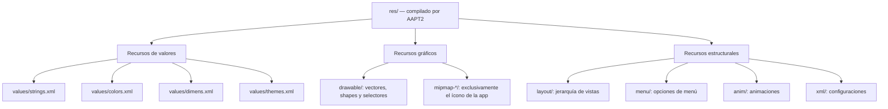

# Informe — Punto 3.7: Recursos de interfaz de usuario

## Carátula

- Asignatura: Programación de Dispositivos Móviles
- Proyecto: MiAgenda INTJEM
- Integrante 1: **[nombre completo y registro universitario]**
- Integrante 2: **[nombre completo y registro universitario]**
- Fecha: **[fecha de entrega]**

## Roles

| Actividad | Conductor | Navegante |
|---|---|---|
| AP-3.7.1 | [completar] | [completar] |
| AP-3.7.2 | [completar] | [completar] |
| AC-3.7.3 | [completar] | [completar] |

## AT-3.7.1 — Mapa de recursos

| Recurso | Carpeta | Acceso desde XML | Acceso desde Java |
|---|---|---|---|
| Nombre de la app | `values/strings.xml` | `@string/app_name` | `getString(R.string.app_name)` |
| Color primario | `values/colors.xml` | `@color/md_primary` | `ContextCompat.getColor(this, R.color.md_primary)` |
| Margen de pantalla | `values/dimens.xml` | `@dimen/screen_margin` | `getResources().getDimensionPixelSize(R.dimen.screen_margin)` |
| Tema principal | `values/themes.xml` | `@style/Theme.MiAgendaINTJEM` | `setTheme(R.style.Theme_MiAgendaINTJEM)` |
| Pantalla principal | `layout/activity_main.xml` | `@layout/activity_main` | `setContentView(R.layout.activity_main)` |
| Ícono de agenda | `drawable/ic_agenda.xml` | `@drawable/ic_agenda` | `ContextCompat.getDrawable(this, R.drawable.ic_agenda)` |
| Ícono de la app | `mipmap-anydpi/ic_launcher.xml` | `@mipmap/ic_launcher` | `R.mipmap.ic_launcher` |
| Menú | `menu/` | `@menu/menu_main` | `getMenuInflater().inflate(R.menu.menu_main, menu)` |
| Animación | `anim/` | `@anim/fade_in` | `AnimationUtils.loadAnimation(this, R.anim.fade_in)` |
| Archivo crudo | `raw/` | `@raw/example` | `getResources().openRawResource(R.raw.example)` |

`mipmap` se reserva para el ícono de lanzamiento porque el launcher puede solicitar una densidad distinta de la densidad física de la pantalla. Mantener sus variantes permite que el sistema escoja una imagen nítida. Los demás gráficos pertenecen en `drawable`.

## AT-3.7.2 — Auditoría de malas prácticas

| Línea observada | Tipo de falla | Consecuencia | Corrección |
|---|---|---|---|
| `layout_width="320px"` | Unidad incorrecta y ancho fijo | El tamaño físico cambia con la densidad y no se adapta al espacio disponible. | Usar `0dp` con restricciones o `wrap_content`. |
| `text="Bienvenido al sistema"` | Cadena literal | Impide seleccionar otra traducción y genera `HardcodedText`. | `text="@string/welcome_message"` |
| `textSize="18px"` | Unidad incorrecta para texto | Ignora `fontScale`; perjudica a usuarios con baja visión. | `textSize="@dimen/text_body"`, definido en `sp`. |
| `textColor="#FF5722"` | Color literal | No admite variante nocturna y su contraste sobre blanco es insuficiente para texto normal. | `textColor="@color/md_on_surface"` o `?attr/colorOnSurface`. |
| `padding="16px"` | Unidad y dimensión no parametrizadas | El espaciado se reduce en pantallas densas y se repite una decisión visual. | `padding="@dimen/spacing_medium"` |
| Sin `android:id` | Falta estructural | La vista no puede enlazarse desde Java ni actuar como ancla. | `android:id="@+id/welcomeText"` |

### Preguntas de discusión

1. Si se usa `px`, el texto no responde al tamaño de fuente configurado por el usuario. `sp` incorpora tanto la densidad como `fontScale`; `px` fija directamente el resultado físico. Además de verse distinto entre densidades, el texto en `px` rompe una adaptación de accesibilidad esencial.

2. Android internacionaliza seleccionando variantes de un recurso con el mismo identificador. Una cadena literal no tiene una entrada intercambiable en `resources.arsc`; por eso debe externalizarse antes de poder crear `values-en`, plurales o traducciones profesionales.

3. Una paleta centralizada ofrece un punto único de cambio, habilita `values-night`, permite auditar contraste y da al equipo un vocabulario semántico. El costo de cambiar una decisión de color deja de crecer con la cantidad de pantallas.

## AP-3.7.1 — Proyecto base

La pantalla principal se construyó con `ConstraintLayout` y contiene encabezado, vector de agenda, mensaje de bienvenida y dos botones. Los layouts solo referencian recursos para textos, colores, dimensiones y gráficos. Java resuelve los recursos por sus identificadores y se limita a enlazar vistas y responder a pulsaciones.

Archivos principales:

- `app/src/main/res/values/colors.xml`
- `app/src/main/res/values/dimens.xml`
- `app/src/main/res/values/strings.xml`
- `app/src/main/res/values/themes.xml`
- `app/src/main/res/layout/activity_main.xml`
- `app/src/main/java/com/example/miagendaintjem/MainActivity.java`

**Captura vertical:** [insertar captura del emulador]

## AP-3.7.2 — Adaptabilidad

La aplicación delega toda adaptación al sistema de recursos:

- `layout-land/activity_main.xml` reorganiza el contenido y conserva los mismos IDs usados por Java.
- `values-en/strings.xml` contiene la traducción inglesa.
- `values-night/colors.xml` redefine los mismos roles semánticos para modo oscuro.
- `values-sw600dp/dimens.xml` amplía márgenes, espaciado, imagen y tipografía en tablet.
- `drawable/ic_agenda.xml` conserva nitidez porque se rasteriza de nuevo para cada densidad.

**Capturas requeridas:** [vertical], [horizontal], [inglés], [modo oscuro] y [tablet].

## AC-3.7.3 — Sistema de diseño Material 3

El tema hereda de `Theme.Material3.DayNight.NoActionBar`. La paleta define roles primarios, secundarios, de superficie y de error con sus pares `on*`. También se declararon tres escalas de forma y cinco apariencias tipográficas para que los componentes de 3.8 hereden decisiones coherentes.

| Par | Claro | Oscuro | Mínimo para texto normal |
|---|---:|---:|---:|
| `primary` / `onPrimary` | 6.57:1 | 7.74:1 | 4.5:1 |
| `primaryContainer` / `onPrimaryContainer` | 13.33:1 | 7.27:1 | 4.5:1 |
| `surface` / `onSurface` | 16.72:1 | 14.29:1 | 4.5:1 |
| `error` / `onError` | 6.46:1 | 7.72:1 | 4.5:1 |

Nombrar por rol conserva el significado cuando cambia el valor. `md_surface` sigue representando una superficie tanto si vale casi blanco como si vale gris oscuro; un nombre como `blanco` dejaría de ser cierto en modo nocturno.

## Dificultades y resolución

- **[Completar con dificultades reales de la pareja.]**
- La discrepancia de nombre entre las guías 3.7 y 3.8 se resolvió usando `MiAgendaINTJEM`, que es el nombre exigido por la actividad donde se crea el proyecto. El nombre visible permanece externalizado para poder corregirlo sin tocar layouts ni Java.

## Conclusiones individuales

- **Integrante 1:** [párrafo propio y firmado]
- **Integrante 2:** [párrafo propio y firmado]

## Anexo

Los archivos `colors.xml`, `dimens.xml` y `strings.xml` se encuentran en `app/src/main/res/values/` y deben anexarse impresos o exportados al informe final.
