# Informe — Punto 3.8: Componentes avanzados de Android

## Carátula

- Asignatura: Programación de Dispositivos Móviles
- Proyecto: MiAgenda INTJEM
- Integrante 1: **Brita Varinia Perez Villegas**
- Integrante 2: **Carlos Andres Flores Carpio**
- Fecha de entrega: **21 de septiembre de 2026**

## Roles invertidos

| Actividad | Conductora | Navegante |
|---|---|---|
| AT-3.8.1 | Brita Varinia Perez Villegas | Carlos Andres Flores Carpio |
| AT-3.8.2 | Brita Varinia Perez Villegas | Carlos Andres Flores Carpio |
| AP-3.8.1 | Brita Varinia Perez Villegas | Carlos Andres Flores Carpio |
| AP-3.8.2 | Brita Varinia Perez Villegas | Carlos Andres Flores Carpio |
| Actividades complementarias | Brita Varinia Perez Villegas | Carlos Andres Flores Carpio |

En 3.7 Carlos fue el conductor principal y Brita la navegante principal. Para 3.8 se invirtieron esos papeles de forma expresa. Brita condujo la implementación y Carlos revisó la correspondencia con la guía, anticipó casos de estado y verificó los flujos en el emulador.

## Aclaración sobre las actividades teóricas

La sección 2.2 de la [consigna oficial](Guia_Actividades_3.8_Android_Java.pdf) no desarrolla enunciados para AT-3.8.1 y AT-3.8.2. La [guía explicada](Guia_3.8_Componentes_Avanzados_EXPLICADA.pdf) identifica esta omisión y pide reconstruir la evidencia teórica a partir de los resultados de aprendizaje y de la defensa. Por ello se incluyen dos actividades: reciclaje de vistas y componentes/ciclos de vida.

## AT-3.8.1 — RecyclerView, Adapter y ViewHolder

`RecyclerView` separa los datos, la creación de vistas y su reutilización. El `Adapter` conoce la colección y traduce cada `Tarea` a una fila visible. El `ViewHolder` conserva referencias a las vistas internas de una tarjeta, por lo que no es necesario buscarlas de nuevo en cada enlace. `LayoutManager` decide la forma de colocar y desplazar los elementos.

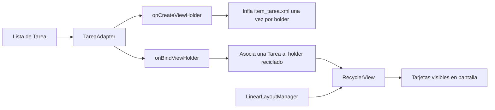

| Aspecto | `ScrollView` + `LinearLayout` | `RecyclerView` |
|---|---|---|
| Creación de filas | Se suelen crear todas desde el inicio. | Crea solo las necesarias para la ventana visible y una reserva interna. |
| Reutilización | No existe por defecto. | Recicla `ViewHolder` que salen de pantalla. |
| Desplazamiento | El contenedor mide una jerarquía completa. | El `LayoutManager` administra el desplazamiento y la disposición. |
| Actualizaciones | Es común reconstruir la lista. | Permite `notifyItemInserted`, `notifyItemChanged` y `notifyItemRemoved`. |
| Eventos | Se conectan manualmente en cada vista creada. | Se conectan una vez en el constructor del `ViewHolder`. |

Ejemplo cuantitativo: con 1.000 tareas, una solución que agrega 1.000 tarjetas a un `LinearLayout` debe crear y conservar las 1.000 jerarquías. Si la pantalla muestra cerca de seis tarjetas, `RecyclerView` trabaja con las visibles y algunas adicionales para el desplazamiento. La cantidad exacta depende del tamaño de cada fila, del dispositivo y de la caché; la ventaja es que no crece uno a uno con toda la colección.

En la implementación, `item_tarea.xml` se infla únicamente dentro de `onCreateViewHolder`. `onBindViewHolder` solo llama a `bind`. Los listeners se registran una sola vez en el constructor y consultan `getBindingAdapterPosition()`; si el resultado es `NO_POSITION`, no procesan el evento. Esto evita actuar sobre una posición obsoleta después de insertar o eliminar.

## AT-3.8.2 — Componentes, Intents y ciclos de vida

### Componentes de Android

| Elemento | Función | Forma de activación | Ejemplo en MiAgenda |
|---|---|---|---|
| `Activity` | Representa una pantalla y coordina interacción visible. | Intent explícito o implícito. | `MainActivity` y `DetalleTareaActivity`. |
| `Service` | Ejecuta trabajo que debe continuar sin una interfaz propia. | `startService` o `bindService`, con restricciones modernas de segundo plano. | No es necesario para esta práctica. |
| `BroadcastReceiver` | Reacciona a un evento difundido por el sistema o una app. | Broadcast registrado en manifiesto o en tiempo de ejecución. | No es necesario para esta práctica. |
| `ContentProvider` | Expone datos estructurados mediante URI y permisos. | `ContentResolver`. | No es necesario porque las tareas se mantienen en memoria. |
| `Fragment` | Controlador de una parte reutilizable de la interfaz, alojado por una Activity. | `FragmentManager` y transacciones. | Tareas, Calendario y Perfil. |

Un `Fragment` no es uno de los cuatro componentes de aplicación que Android puede iniciar directamente. Su ciclo de vida depende de la Activity anfitriona y su vista tiene un ciclo adicional; por eso las referencias a vistas se liberan en `onDestroyView`.

### Activity y Fragment

| Criterio | Activity | Fragment |
|---|---|---|
| Alcance | Pantalla y ventana completa. | Sección alojada dentro de una Activity. |
| Declaración | Normalmente en `AndroidManifest.xml`. | En XML o mediante `FragmentManager`. |
| Navegación usada | Intent explícito al detalle. | Transacción `replace` desde la navegación inferior. |
| Estado | `onSaveInstanceState` y resultado de Activity. | Restauración automática del `FragmentManager` y estado propio del Fragment. |
| Vista | Vive normalmente durante la Activity. | Puede destruirse antes que la instancia del Fragment. |

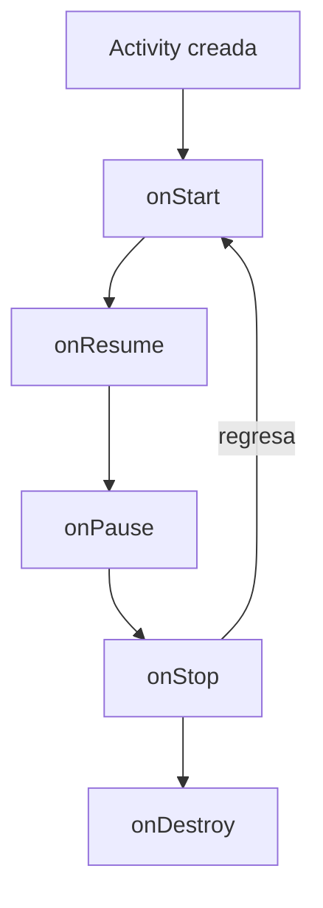

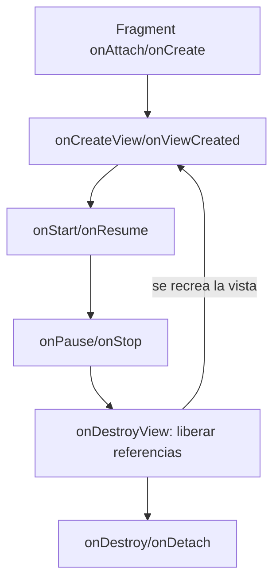

### Intent explícito e implícito

El Intent a `DetalleTareaActivity` es explícito porque declara la clase de destino. La `Tarea` viaja como `Parcelable`; el receptor conoce exactamente el contrato y devuelve la tarea editada mediante `setResult`. `ActivityResultLauncher` recibe ese resultado respetando el ciclo de vida.

El Intent para compartir es implícito porque describe una acción (`ACTION_SEND`), el tipo `text/plain` y el contenido, sin elegir una aplicación. `Intent.createChooser` deja que el usuario escoja un receptor compatible.

## AP-3.8.1 — Lista eficiente de tareas

Se implementó el modelo `Tarea` con los campos obligatorios `id`, `titulo`, `materia`, `fechaEntrega` y `prioridad`. Tanto `materia` como `prioridad` son `enum`: cada valor guarda su identidad y delega la etiqueta visible —y, en el caso de la prioridad, también el color— a recursos. Así una tarea sigue siendo la misma aunque cambie el idioma del dispositivo.

La pantalla carga ocho tareas de ejemplo y configura:

- `RecyclerView` con `LinearLayoutManager`;
- `TareaAdapter extends RecyclerView.Adapter<TareaAdapter.TareaViewHolder>`;
- `MaterialCardView` como raíz de `item_tarea.xml`;
- indicador de prioridad alta, media o baja;
- Toast y apertura del detalle al pulsar;
- diálogo de confirmación al mantener pulsado;
- FAB para crear una tarea;
- avisos granulares al Adapter, sin `notifyDataSetChanged`.

El ID estable de cada tarea separa la identidad del objeto de la posición visible. Esta distinción es necesaria porque el filtro cambia posiciones y porque una eliminación desplaza los elementos siguientes.

### Fragmentos de código relevantes

El adaptador infla la vista una sola vez por `ViewHolder` y `onBindViewHolder` se limita a
enlazar datos. Esta separación es justamente el criterio de rechazo de la consigna:

```java
@NonNull
@Override
public TareaViewHolder onCreateViewHolder(@NonNull ViewGroup parent, int viewType) {
    View itemView = LayoutInflater.from(parent.getContext())
            .inflate(R.layout.item_tarea, parent, false);
    return new TareaViewHolder(itemView);
}

@Override
public void onBindViewHolder(@NonNull TareaViewHolder holder, int position) {
    holder.bind(tasks.get(position));
}
```

Los listeners se registran una vez en el constructor del `ViewHolder`, no en cada enlace, y
consultan la posición en el momento del evento:

```java
TareaViewHolder(@NonNull View itemView) {
    super(itemView);
    titleText = itemView.findViewById(R.id.taskTitleText);
    // ...
    itemView.setOnClickListener(view -> {
        int position = getBindingAdapterPosition();
        if (position != RecyclerView.NO_POSITION) {
            listener.onTareaClick(tasks.get(position), position);
        }
    });
}
```

`getBindingAdapterPosition()` puede devolver `NO_POSITION` mientras hay una animación de
inserción o borrado en curso. Comprobarlo evita actuar sobre una fila que ya no existe.

`item_tarea.xml` usa `MaterialCardView` como raíz y no contiene un solo valor literal:

```xml
<com.google.android.material.card.MaterialCardView
    android:layout_width="match_parent"
    android:layout_height="wrap_content"
    android:layout_marginStart="@dimen/screen_margin"
    app:cardCornerRadius="@dimen/corner_medium"
    app:cardElevation="@dimen/task_card_elevation"
    app:strokeColor="?attr/colorOutline">
    <!-- indicador de prioridad + título, materia y fecha -->
</com.google.android.material.card.MaterialCardView>
```

El alta notifica una sola fila en lugar de reconstruir la lista completa:

```java
Tarea added = agendaActivity().createTask(title, subject, dueDate, priority);
if (matchesCurrentFilter(added)) {
    int position = visibleTasks.size();
    visibleTasks.add(added);
    adapter.notifyItemInserted(position);
    taskList.scrollToPosition(position);
}
```

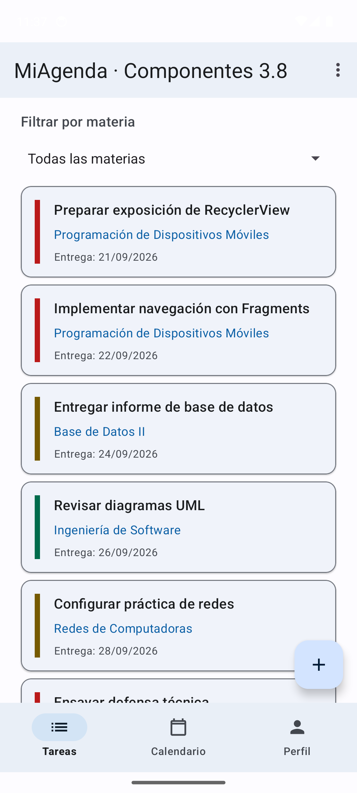

### Alta y eliminación

El diálogo valida que título y fecha no estén vacíos. Al guardar se agrega una única fila con `notifyItemInserted`; al eliminar se quita una única fila con `notifyItemRemoved`.

| Alta de tarea | Confirmación de eliminación |
|---|---|
| 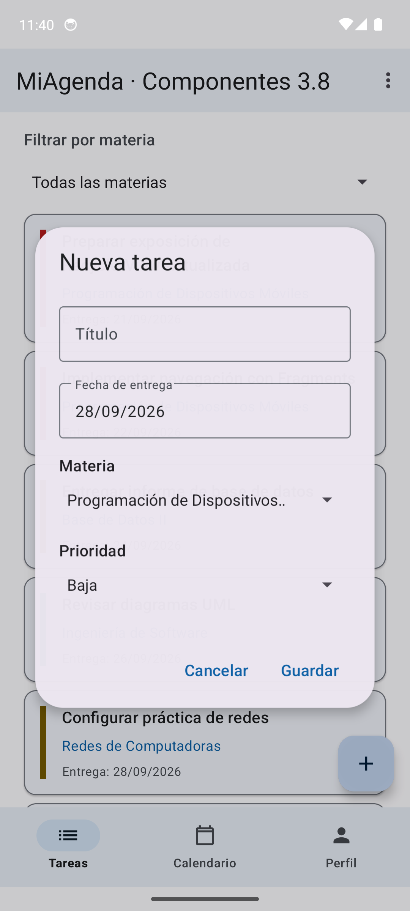 | 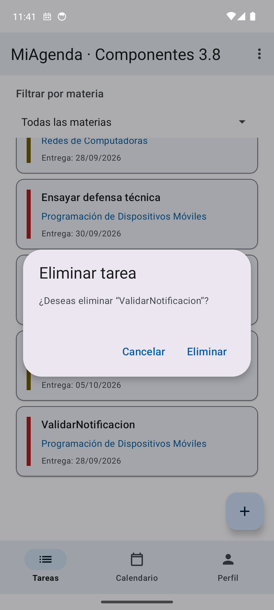 |

## AP-3.8.2 — Detalle, navegación y comunicación

`DetalleTareaActivity` recibe la tarea mediante un Intent explícito. El usuario puede modificar el título y devolver la copia actualizada. La lista busca la tarea por ID y refresca solo la tarjeta correspondiente. La misma pantalla construye un Intent implícito para compartir título, materia, fecha y prioridad.

| Detalle editable | Selector de Android para compartir |
|---|---|
| 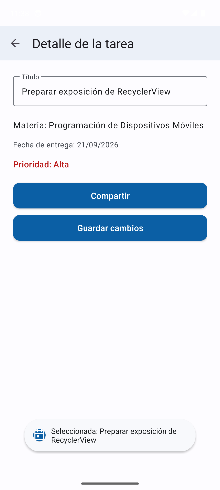 | 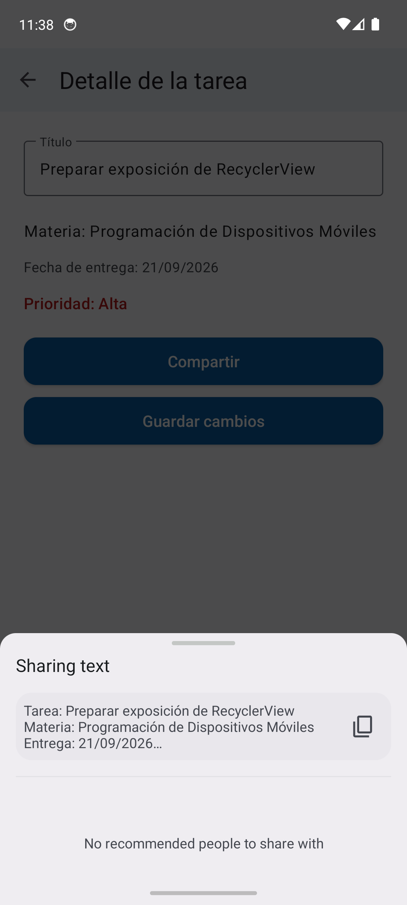 |

### Fragmentos de código relevantes

Intent **explícito**: nombra la clase de destino y adjunta la `Tarea` como `Parcelable`.

```java
int sourcePosition = agendaActivity().findTaskIndex(task.getId());
Intent intent = new Intent(requireContext(), DetalleTareaActivity.class)
        .putExtra(DetalleTareaActivity.EXTRA_TAREA, task)
        .putExtra(DetalleTareaActivity.EXTRA_POSICION, sourcePosition);
detailLauncher.launch(intent);
```

Intent **implícito**: describe una acción y un tipo, nunca una clase. El sistema ofrece las
aplicaciones capaces de atenderla.

```java
Intent shareIntent = new Intent(Intent.ACTION_SEND)
        .setType("text/plain")
        .putExtra(Intent.EXTRA_SUBJECT, getString(R.string.share_subject, visibleTitle))
        .putExtra(Intent.EXTRA_TEXT, body);

startActivity(Intent.createChooser(shareIntent, getString(R.string.share_chooser_title)));
```

Retorno del resultado con `ActivityResultLauncher`, registrado en `onCreate` del Fragment
para respetar el ciclo de vida. La lista se refresca por identidad, no por posición:

```java
Tarea updated = IntentCompat.getParcelableExtra(
        result.getData(), DetalleTareaActivity.EXTRA_TAREA, Tarea.class);

agendaActivity().updateTask(updated);
int visiblePosition = findVisiblePosition(updated.getId());
if (visiblePosition >= 0 && adapter != null) {
    visibleTasks.set(visiblePosition, updated);
    adapter.notifyItemChanged(visiblePosition);
}
```

Reemplazo de Fragments. La transacción inicial solo ocurre en el primer arranque; si
`savedInstanceState` no es nulo, `FragmentManager` ya restauró la sección:

```java
if (savedInstanceState == null) {
    navigation.getMenu().findItem(R.id.nav_tasks).setChecked(true);
    showSection(R.id.nav_tasks);
}
// ...
getSupportFragmentManager()
        .beginTransaction()
        .replace(R.id.fragmentContainer, target)
        .commit();
```

`MainActivity` contiene una `MaterialToolbar`, un contenedor de Fragments y un `BottomNavigationView`. Las opciones Tareas, Calendario y Perfil reemplazan el contenido mediante `FragmentManager`. El menú de la Toolbar expone “Acerca de”. La transacción inicial solo se realiza cuando `savedInstanceState` es nulo; así no se superpone un Fragment nuevo al que Android acaba de restaurar.

| Calendario | Perfil y roles invertidos |
|---|---|
|  | 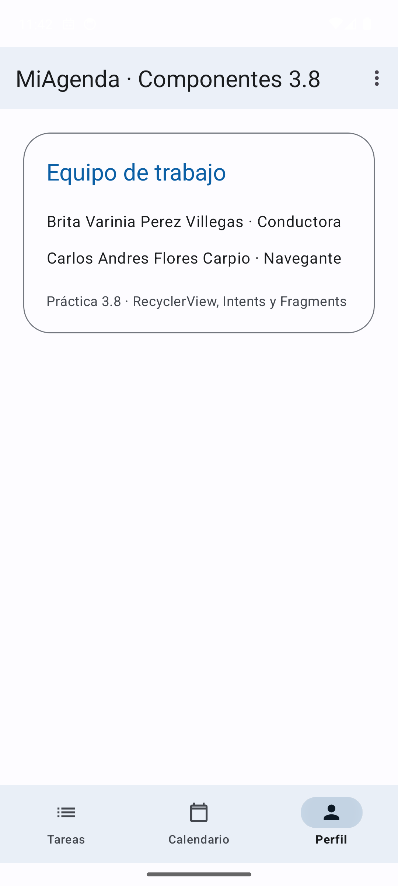 |

### Conservación de estado

Las tareas y el próximo ID se guardan en el `Bundle` de `MainActivity`. El filtro se guarda en el Fragment. `FragmentManager` restaura la sección activa y el estado comprobado conserva incluso una lista vacía. Las referencias a la vista del Fragment se anulan en `onDestroyView` para no retener una jerarquía destruida.

La prueba editó el primer título, rotó el emulador y comprobó mediante la jerarquía de UI que el nuevo texto seguía presente. También se rotó desde Perfil y se comprobó que Perfil continuaba seleccionado.

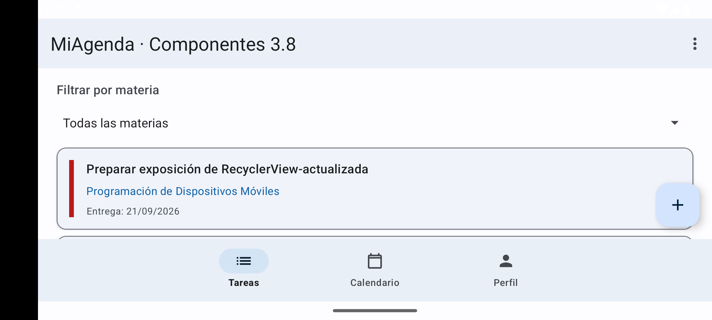

## Actividades complementarias

### Filtro por materia

El `Spinner` filtra sobre la fuente de datos conservada en `MainActivity`. La lista visible es una proyección independiente; por ello una pulsación siempre se traduce por el ID de la tarea y no por la posición de la lista completa.

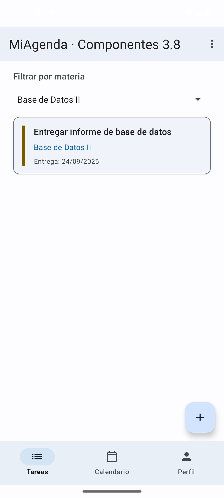

### Notificación de prioridad alta

La aplicación crea un canal con importancia alta desde `MiAgendaApplication`. En Android 13 o superior solicita `POST_NOTIFICATIONS`. Al crear una tarea de prioridad alta usa un `PendingIntent` inmutable para volver a `MainActivity`. La prueba en Android 14 confirmó mediante `dumpsys notification` el paquete, el canal `high_priority_tasks`, la importancia 4 y el texto de la tarea creada.

## Matriz de verificación

| Requisito | Evidencia | Resultado |
|---|---|---|
| Java, `minSdk 24`, `targetSdk 34` | `app/build.gradle` | Cumple |
| Ocho tareas iniciales | Lista principal y `loadSampleTasks` | Cumple |
| Adapter y ViewHolder propios | `TareaAdapter.java` | Cumple |
| Inflado fuera de `onBindViewHolder` | `onCreateViewHolder` | Cumple |
| Cadenas, colores y dimensiones sin literales en el ítem | `item_tarea.xml` y recursos | Cumple |
| Click con listener propio y Toast | `OnTareaClickListener` | Cumple |
| FAB y actualización granular | `notifyItemInserted` | Cumple |
| Pulsación larga y confirmación | Captura de eliminación | Cumple |
| `Parcelable` e Intent explícito | `Tarea` y `DetalleTareaActivity` | Cumple |
| Resultado de edición | `ActivityResultLauncher` | Cumple |
| Intent implícito `ACTION_SEND` | Selector del sistema | Cumple |
| Tres Fragments y navegación inferior | Tareas, Calendario y Perfil | Cumple |
| Toolbar y menú | `menu_main.xml` | Cumple |
| Estado después de rotación | Captura horizontal y jerarquía de UI | Cumple |
| Filtro y notificación opcionales | Pruebas en el emulador | Cumple |
| Filtro correcto tras cambio de idioma | `enum Materia` y prueba con `cmd locale set-app-locales` | Cumple |
| Permiso de notificaciones pedido una sola vez | Marca conservada en `MainActivity` | Cumple |
| Compilación y Lint | `assembleDebug` y `lintDebug` | Cumple, cero hallazgos |

## Dificultades y resolución

- La primera dificultad fue conservar una única fuente de tareas mientras los Fragments se reemplazaban. Si cada Fragment creaba su propia lista, una edición desaparecía al cambiar de sección. Se alojó la colección en `MainActivity` y el Fragment trabaja con una proyección filtrada.
- El filtro hacía incorrecto usar directamente la posición visible para editar o borrar. Se añadió un ID estable y todas las operaciones buscan la tarea por identidad; la posición se usa únicamente para notificar al Adapter qué fila visible cambió.
- La rotación podía volver a cargar las ocho muestras cuando la lista restaurada estaba vacía. Se distinguió el primer arranque (`savedInstanceState == null`) de una restauración válida, incluso si contiene cero elementos.
- La revisión final destapó un fallo que la compilación no detecta. `Tarea` guardaba la
  materia como el texto ya traducido que devolvía `getString`, y el filtro comparaba ese
  texto con la etiqueta seleccionada en el `Spinner`. Mientras el idioma no cambiara, todo
  funcionaba. Al cambiar el idioma con la aplicación abierta, el `Spinner` pasaba a inglés
  y las tareas conservaban las materias en español: filtrar por «Mobile Device
  Programming» devolvía cero tarjetas cuando había cuatro. Se comprobó en el emulador con
  `cmd locale set-app-locales`. La solución fue introducir el `enum Materia`, simétrico a
  `Prioridad`: la tarea guarda el valor y la etiqueta se resuelve al pintar. La misma
  prueba después del cambio devuelve las cuatro tarjetas. La lección es que un identificador
  nunca debe ser una cadena visible, porque las cadenas visibles dependen de la configuración.
- El permiso de notificaciones se solicitaba en `onViewCreated`. Como el Fragment se recrea
  al cambiar de sección y al rotar, el diálogo reaparecía una y otra vez. La marca de
  «permiso ya solicitado» se trasladó a `MainActivity` y se conserva en su `Bundle`, de modo
  que se pide una sola vez por ejecución.
- Las notificaciones cambian según la versión de Android. Se creó el canal desde API 26 y se solicita permiso solo desde API 33. Si el usuario lo rechaza, la agenda continúa funcionando.
- Durante la validación fue necesario diferenciar que un Fragment conserva su instancia y que su vista puede destruirse. Se desacopló el Adapter en `onDestroyView` y se anularon referencias para evitar retener la vista anterior.

## Conclusiones individuales

- **Brita Varinia Perez Villegas:** Como conductora principal implementé la lista con `RecyclerView`, el Adapter, el ViewHolder y los flujos de alta, edición y eliminación. Aprendí que una lista eficiente no depende solo de mostrar tarjetas, sino de reciclar vistas, mantener IDs estables y avisar exactamente qué elemento cambió. También comprobé que el ciclo de vida influye en decisiones de datos: guardar el estado y evitar recrear Fragments mantiene una experiencia continua después de rotar el dispositivo.
- **Carlos Andres Flores Carpio:** Como navegante principal revisé la implementación contra la consigna y propuse casos de prueba para posiciones filtradas, retorno de resultados, rotación e Intents. Comprendí mejor la diferencia entre un Intent explícito, que abre una pantalla conocida, y uno implícito, que delega la elección al sistema. La revisión en el emulador mostró que validar estados intermedios, como una tarea editada o una sección seleccionada, permite encontrar errores que una compilación por sí sola no detecta.

## Anexo técnico

La aplicación se verificó en el AVD `MiAgenda_API_34`, perfil Pixel 6, Android 14/API 34, Google APIs y ABI `arm64-v8a`. Se completaron compilación, Lint, instalación, inicio en frío y recorridos de interfaz. El repositorio conserva la historia de 3.7 y agrega commits separados para implementación y documentación de 3.8; puede revisarse con:

```bash
git log --oneline --decorate
```

Las dos guías originales se copiaron en `docs/`.

### Enlace al repositorio

El punto 7 de la estructura del informe exige un enlace al repositorio con el historial de
commits visible, incluyendo la guía del punto 3.7.

- **URL del repositorio:** `(completar al publicar)`

El historial cumple la condición de contener ambas guías. La rama `main` arranca con los
cuatro commits de la práctica 3.7 y continúa con los de la 3.8, de modo que la continuidad
entre ambas queda registrada y no solo declarada:

```
feat: implementar práctica 3.7 de Android
chore: evitar fijar el JDK local de Gradle
docs: añadir evidencia de validación en emulador
docs: completar reporte de la práctica 3.7
... continúan los commits de la práctica 3.8
```

El historial completo se revisa con:

```bash
git log --oneline --decorate --reverse
```

La rama `practica-3.7` conserva el proyecto tal como se entregó en la guía anterior, con su
pantalla única y sus calificadores de configuración. La rama `main` contiene la aplicación
de la guía 3.8, que es la versión ejecutable de esta entrega.

No se atribuyeron commits a identidades ajenas: cada commit registra al integrante que
realizó efectivamente el cambio. Publicar el repositorio antes de la entrega es obligatorio,
porque la consigna evalúa el historial visible y no solo el código.
